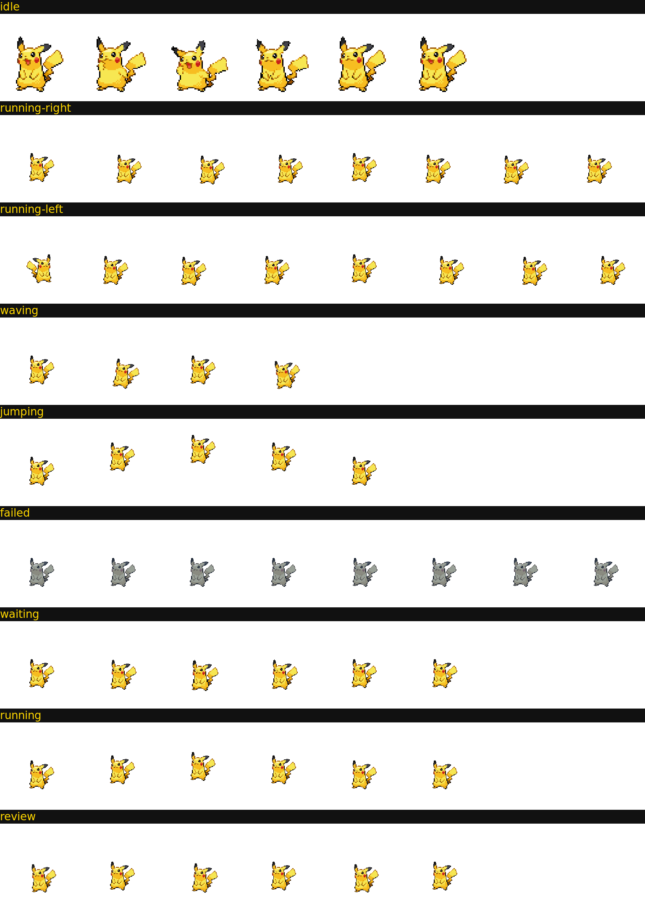

# DSH Pet Companion 🐾

把 OpenAI **Codex Pets** 的宠物陪伴体验带进 **DeepSeek Harness**（DSH）Web GUI 的 Cordis 插件。

> 用宠物的行为状态代替进度条 —— 你的皮卡丘/小火龙会用动画告诉你 agent 正在思考、等你确认、还是完成了待你审查。



## 它解决了什么问题

AI coding agent 跑长任务时（几分钟到十几分钟），你无法直观知道它现在在干什么：

| Agent 状态 | 宠物表现 | 你该做什么 |
| --- | --- | --- |
| 思考中 / 写代码 | 原地跑动动画 | 去喝杯咖啡 ☕ |
| 等待你确认 / 审批 | 停下来盯着你看 | 回 DSH 响应 |
| 完成待审查 | 端坐/专注姿态 | 去看 diff |
| 出错 | 灰蓝色沮丧抖动 | 检查错误 |
| 空闲 | 呼吸/眨眼，偶尔挥手跳跃 | 陪它玩 😄 |

这正是 Codex Pets 的核心设计哲学：**"agent 正在做什么"比"agent 是什么动物"更重要**。

## 特性

- 🖼️ **内置两只宠物**：皮卡丘（#25）与小火龙（#4）
  - idle 动画来自 PokeAPI 第五世代官方动画帧
  - 其余 8 个状态由经典精灵程序化派生（翻转/弹跳/挥手/沮丧/呼吸/跑动/审查）
- 🎬 **9 状态动画**：idle / running / waiting / review / failed / waving / jumping / running-left / running-right
- 📍 **浮动宠物**：注册到 `shell.overlay`，右下角常驻，可拖拽、点击弹菜单、一键隐藏
- ⚙️ **设置页**：Settings → Pet Companion，切换宠物、大小（小/中/大）、开关、重置位置
- 📦 **petdex 兼容宠物包格式**：`pet.json` + 8×9 spritesheet（每帧 192×208）——社区标准，未来可直接导入 petdex.dev 上 4500+ 个社区宠物
- 🔌 **零侵入**：只监听 DSH 现有事件（emit 模式），不阻塞、不篡改任何流程

## 快速开始

### 方式一：动态插件（开发/试用）

```bash
git clone https://github.com/<your-org>/dsh-pet-companion.git
cd dsh-pet-companion
# 确保 packs/ 目录在 DSH 会话工作区可见（插件 Host 端默认从工作区根目录的 packs/ 读取）
```

在 DSH 会话中使用 `cordis_define` + `cordis_run` 加载 `plugin/pet-companion.host.js` 与 `plugin/pet-companion.client.js`，批准后皮卡丘就会出现。

### 方式二：作为仓库插件安装（规划中）

插件包结构已就绪，后续提供一键安装脚本。

## 架构

```
plugin/
├── pet-companion.host.js    # Host: 状态引擎（事件→状态机）+ pet/state、pet/asset RPC
└── pet-companion.client.js  # Client: shell.overlay 浮动宠物 + settings.section 设置页
packs/
├── pikachu/{pet.json, spritesheet.png}
└── charmander/{pet.json, spritesheet.png}
scripts/generate-packs.js    # 从 sprites/ 源素材生成宠物包（ImageMagick）
sprites/                     # 源素材（PokeAPI / Showdown 精灵）
docs/                        # 预览图
```

**状态优先级**：`waiting（审批） > failed（错误） > review（回合结束） > running（思考/工具/子代理） > idle`

**数据流**：Host 监听 `agent/status`、`agent/turn-stopping`、`agent/error`、`approval/request`、`tools/execute|result`、`subagent/start|end`、`workflow/start|end` → 推导状态 → Client 每 600ms 轮询 `pet/state` → 播放对应动画行。

## 宠物包格式（petdex 兼容 v1）

- `pet.json`：`{ id, displayName, description, spritesheetPath }`
- `spritesheet.png`：**8 列 × 9 行**，每帧 192×208，行序固定：

| 行 | 状态 | 帧数 | 用途 |
| --- | --- | --- | --- |
| 0 | idle | 6 | 呼吸/眨眼 |
| 1 | running-right | 8 | 向右跑 |
| 2 | running-left | 8 | 向左跑 |
| 3 | waving | 4 | 打招呼 |
| 4 | jumping | 5 | 跳跃 |
| 5 | failed | 8 | 出错 |
| 6 | waiting | 6 | 等待 |
| 7 | running | 6 | 原地跑 |
| 8 | review | 6 | 审查 |

## 重新生成宠物包

```bash
# 依赖 ImageMagick 6+
node scripts/generate-packs.js
```

## 素材来源与致谢

- 皮卡丘/小火龙经典精灵与第五世代动画帧：**[PokeAPI/sprites](https://github.com/PokeAPI/sprites)**（社区广泛使用的游戏素材镜像）
- 动画参考：**[Pokemon Showdown](https://play.pokemonshowdown.com/sprites/ani/)** 动画精灵（`sprites/` 目录已备）
- 宠物包格式规范：**[petdex](https://github.com/crafter-station/petdex)**（Codex 宠物社区标准，MIT）
- 产品逻辑参考：OpenAI Codex Pets（running / waiting for input / ready for review 三状态范式）

## Roadmap

- [ ] 导入 petdex.dev 社区宠物包（manifest API 直连）
- [ ] 多会话多宠物（并发任务各自一只）
- [ ] 宠物孵化玩法（按你写的语言/风格出宠物，致敬 hatch-pet）
- [ ] 浏览器端配置持久化（localStorage）

## License

[MIT](LICENSE)
